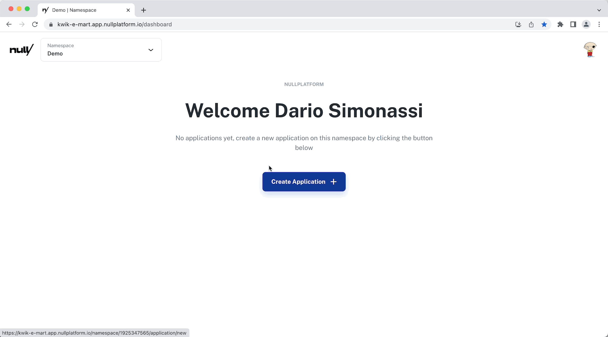
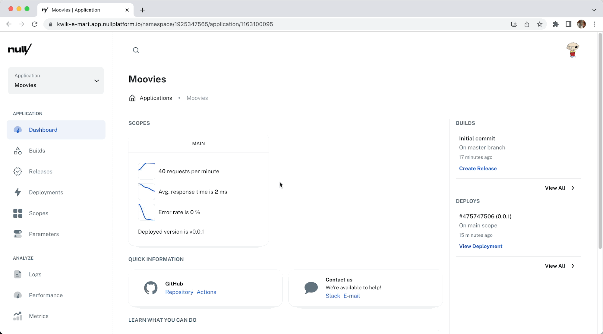
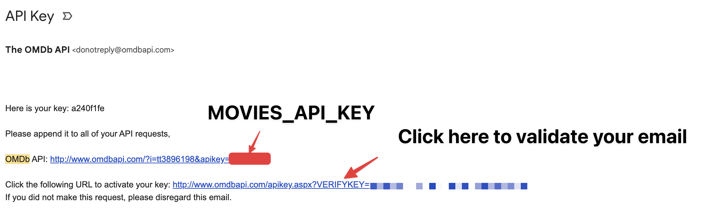

# Nullplatform Sample Application Tutorial

In this tutorial, we'll guide you through the process of creating a JavaScript application using Fastify that searches for movies using the OMDB API. As we go through the tutorial, we'll also explore nullplatform's UI and show you how to use it to deploy and manage your application.

By the end of the tutorial, you'll have a fully functional application that you can customize deplot and play. Let's get started!

> **Important**: Before you begin this tutorial, please ensure that you have:
> 1) A [nullplatform](https://www.nullplatform.com) account that works in your organization or you can request access to our [sandbox](https://forms.gle/bmsZ3r51WQnofAw49) and we'll email you the credentials.
> 2) An [OMDB API](https://www.omdbapi.com/apikey.aspx) access token. 

We're going use [nullplatform](https://www.nullplatform.com) to:

* Create Github repository based on this template.
* Setup CI & Building pipeline.
* Create the necessary infrastructure to release the application to production.
* Configure the application using environment variables.
* Browse and search application logs.
* Analyze performance metrics
* Browse custom (business) metrics.


But don't worry, as complex as it may sound, this is going to be super straightforward and fast. In less than 10 minutes you'll be playing with the deployed app. 

## Create an new application
__Name your aplication__:
The first step is to give your new application a name. This can be anything you like, but make sure it's descriptive and unique. Once you've decided on a name, enter it into the application name field.

__Pick the right template__:
When creating a new application, it's important to start with a solid foundation. That's where templates come in. Templates are pre-built structures that provide a meaningful starting point for your application.

For this tutorial, we'll be using the ___Tutorial: Movie Search Application___ template, which is specifically designed to guide you through _nullplatform_ features. This template includes some pre-built [fastify](https://www.fastify.io/) endpoints that will serve as an example and some logs and parameters that will serve to show-off _nullplatform features!_ .

Choose the ___Tutorial: Movie Search Application___ template from the list of available templates.

__Make sure you select *"Deploy application"*:__
Make surethe *"Deploy Application"* option is checked before clicking the *"Create Application" button. This will automatically deploy your application to your cloud infrastructure, making it available for use right away.

__Click *"Create Application"*:__
Once you click on *Create Application* your application will be running in your cloud account in minutes.



### You are all set! 
Congratulations! You've just created a brand-new application that will soon be up and running in production. During the creation process, a number of important things have happened, including:
* Brand-new infrastructure has been provisioned within your cloud provider, within a secure network that you control.
* Autoscaling, autohealing, and rightsizing have been provided out-of-the-box, along with automatic spotfleet selection that can deliver up to 50% cloud-cost savings automatically.
* A new private GitHub repository has been created that is owned by your GitHub organization.

After just a few minutes, your application will be fully operational and ready for use. We'll start customizing it to meet the demo needs, adding your own code, configurations and browsing logs and metrics.


### Congratulations! 

your new application is up and running! Here are a few things you can do now:

* Explore the code in your new repository to get a better understanding of how it works and make any necessary changes.
* Access your application's landing page by clicking on the "View Application" button. From there, you can operate your application, including creating a new release, deploying it, and accessing logs and metrics.

Now that your application is up and running, you have full control over its development and operation.


### Now lets browse your new productive application!

* Go to the __"Scopes"__ section in the left-hand menu.
* You'll see the main scope there. Scopes are like clusters, you can create as many clusters as you want for your application. We'll explore this topic in more detail later on.
* Click on the __"Domain"__ link in the main Scope card to access your new application.



### Ooops! It looks like some configuration is needed!

When we browse our new application, we may receive an error response that looks like this:

``` json
{
   "message": "Either MOVIES_API_KEY or MOVIES_API_URL parameter is missing"
}
```
This error message indicates that our application requires some environment configuration to operate correctly. If we take a look at the `index.js` file, we can see that our application needs two environment variables to run properly:

```` javascript
/**
 * Read some operational configuration and secrets!
 */
const apiKey = process.env.MOVIES_API_KEY;
const apiUrl = process.env.MOVIES_API_URL;
````

To fix this issue, we need to provide valid values for `MOVIES_API_KEY` and `MOVIES_API_URL` environment variables. These variables contain sensitive information that should not be hard-coded into our code. We'll cover how to set up these variables in the next steps.

## Configuration management in _nullplatform_


### Setting `MOVIES_API_URL` parameter
Managing configuration parameters in nullplatform is easy! Follow these steps to create the `MOVIES_API_URL` variable:

1) Navigate to the __Parameters__ section in the left-hand menu.
2) Click on "+ New Parameter" button to create a new parameter.
3) Choose a meaningful name for your parameter that will help you and your team identify its purpose. This name doesn't need to match the environment name and can contain spaces.
4) Next, choose whether you want to represent the parameter as an environment or a configuration file. Since we want our parameter to be an environment variable, check the Environment Variable option.
5) Specify the __"Variable Name"__ that matches the name you specified in your application, in this case, `MOVIES_API_URL`.
6) Then we specify the __"Variable name"__, now we have to match the name we specified in the application, in our case `MOVIES_API_URL`.
7) We have two options: we can set a default value for all the application __Scopes__, or we can be more specific and override a parameter for a given __Scope__. In this tutorial, we're working on the main __Scope__, so we'll select the __Main__ tab and set the value like in the picture below.
8) Finally, we click the __"Create Parameter"__ button to proceed.

By following these steps, you have set up the `MOVIES_API_URL` parameter in _nullplatform_, and your application should now be able to access this environment variable in the next deployment.


### Setting `MOVIES_API_KEY` parameter as a _secret_ 


> Before we can proceed, please ensure that you have an API key for the [OMDB API](https://www.omdbapi.com/apikey.aspx). Once you've registered for an API key, you'll receive an email that looks like this:
> 
> Copy the token from the URL provided in the email and don't forget to validate your email by clicking the link below it.

Follow these steps to set up the `MOVIES_API_KEY` parameter as a secret in nullplatform:


1) Check your inbox and copy your API token.
2) Follow the same steps as before, but replace the parameter and variable names with appropriate ones.
3) Before clicking on the __"Create Parameter"__ button, check the __"Set value as secret"__ option.
4) Finally create it!.

By setting the `MOVIES_API_KEY` parameter as a __Secret__, we ensure that sensitive information is not displayed in plain text in our code or frontend. This is an important step to take when managing configuration parameters that contain sensitive information. From now on, we can only change this parameter, but never read it again from the UI, ensuring maximum security for our application.


## Deploying new releases using _nullplatform_

Let's deploy our application, so parameters can be applied!


3) Making a change:
   1) Adding a new Log.
   2) Commiting
>VIDEO Making changes and creating your own build.

4) Deploying the application:
   1) Creating a release.
   2) Deploying a release.
   3) Switching the traffic.

>VIDEO Release, Deploy, Switch traffic.

6) Using logs:
   1) Logs in the sample application: 
   2) Browsing logs
      1) Date filter
      2) Tail
   3) Searching logs
      1) Querying structured and non structured logs.

>VIDEO Explore logs-pretty print, search logs. 

7) Analyzing performance:

>VIDEO Analyzing performance.

8)Analyzing business metrics in the infrastructure context:

>VIDEO Review the code for existing custom metrics,


   


# Sample API Tutorial Application

This is a simple [Fastify](https://www.fastify.io/) application that showcases some of the [nullplatform](https://www.nullplatform.com) features. 

`GET /movie?name="top gun"`: Retrieves all the movies that contains `top gun` in it's title.

`PATCH /movie/:id/my`: Set your valuation for a movie.

`GET /movie/:id`: 

`GET /movie/:id/my`:

## Getting started


### Make sure you have a [nullplatform](https://www.nullplatform.com) account.

* If you don't have a nullplatform account you can [request one](https://nullplatform.com/signup).


### Create a new application in your [nullplatform](https://www.nullplatform.com) account.

* Make sure to deploy your application into a scope

### 

To install the application, simply clone the repository and run `npm install`:

```bash
git clone https://github.com/your-username/fastify-app.git
cd fastify-app
npm install
